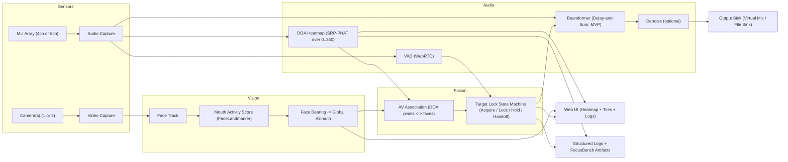
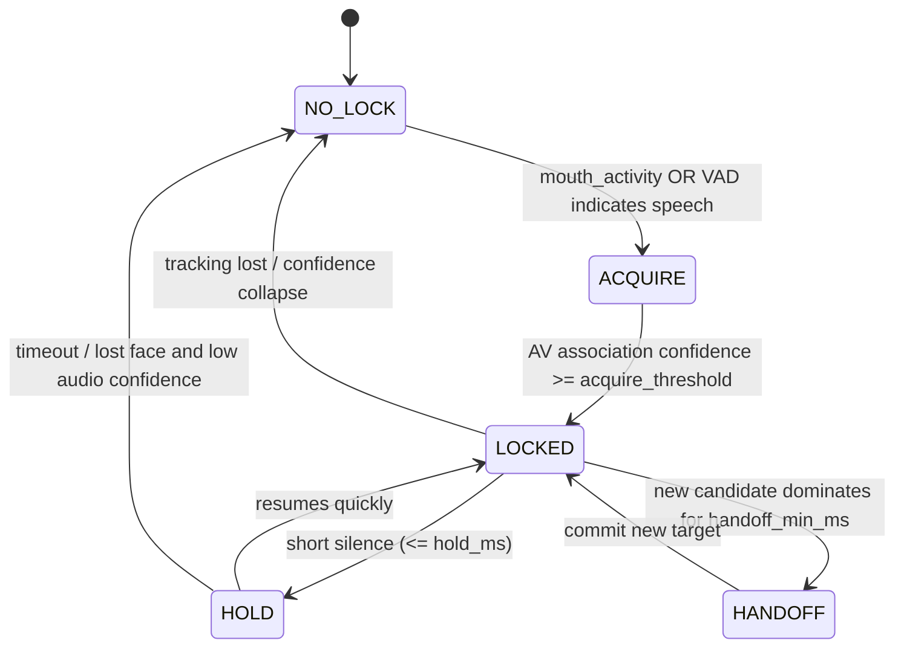
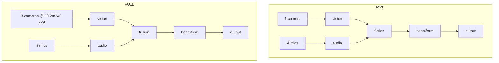
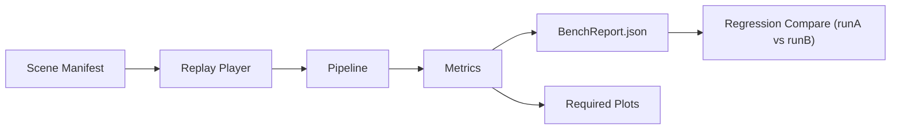

# FocusField

FocusField is a portable "acoustic lens" for calls. It identifies who is speaking (via mouth activity), localizes where the sound is coming from (via a 360 deg acoustic heatmap), locks onto the intended talker, beamforms to suppress off-axis talkers/noise, and outputs a single "clean microphone" stream suitable for conferencing apps. No panorama stitching is required; the UI renders camera tiles plus a polar acoustic heatmap.

FocusField is built to scale by configuration:

MVP: 1 camera + 4 microphones (fast to ship)

Full: 3 cameras + 8 microphones (360 deg coverage, stronger suppression)

What FocusField is not:

It does not perform open-air room noise cancellation.

It does not guarantee perfect separation of multiple simultaneous speakers.

## System overview

## Acoustic heatmap definition

The 360 deg heatmap is computed from multichannel audio using SRP-PHAT (scores over azimuth bins). Vision does not generate the acoustic heatmap; vision provides a speaker prior (mouth activity) used to select and stabilize the beam steering target.

## Data contracts

All modules communicate using standardized message types: AudioFrame, AudioVad, VideoFrame, FaceTrack, DoaHeatmap, TargetLock, EnhancedAudio, LogEvent. These contracts are the single source of truth:

- contracts/messages.md
- contracts/json_schemas/...
- contracts/invariants.md

## Target lock logic (what makes FocusField usable)

FocusField does not chase the loudest sound blindly. It locks onto a target using mouth activity + audio DOA agreement and applies hysteresis to prevent jitter.

## MVP vs Full builds

MVP (1 cam + 4 mic): validates end-to-end focusing, UI, and quantitative metrics in a controlled setup.
Full (3 cam + 8 mic): upgrades coverage and suppression; the pipeline stays unchanged (config + hardware adapters only).

## Calibration and repeatability

FocusField includes explicit calibration artifacts so results are reproducible:

- Camera bearing calibration (pixel->bearing->global azimuth)
- Mic array geometry + channel-order verification
- Time sync sanity checks (audio/video skew bounds)

## FocusBench (quantitative evaluation and regression)

FocusBench replays recorded scenes (audio and optional video), runs the identical pipeline deterministically, and produces a report bundle with plots and metrics (MAE, delta SIR, WER, latency histograms). This prevents "it sounded better bro."

## Required metrics (minimum reporting set)

- Steering MAE (deg) vs angle and environment
- Target selection accuracy (%) in 2-person tests
- Interferer suppression delta SIR (dB) vs interferer angle
- Intelligibility proxy: ASR WER reduction (%)
- Added latency (ms) + dropouts (count)

Definitions and module contracts are embedded in `src/focusfield/**.py` docstrings and summarized in `docs/11_contract_index.md`.

## Deliverables

- A portable sensor pod + pipeline producing a focused "clean mic" stream for calls
- UI showing camera tiles, 360 deg heatmap, and lock status (with active-speaker highlight)
- FocusBench reports enabling regression testing and quantitative claims
